# App Development with ReactJS and React Native

## Index

| No. | Topic                            | No. | Topic                                       |
| --- | -------------------------------- | --- | ------------------------------------------- |
| 1   | [ReactJS](./pages/react/1.md)    | 6   | [Conditional Rendering](./pages/react/6.md) |
| 2   | [Toolchains](./pages/react/2.md) | 7   | [Hooks](./pages/react/7.md)                 |
| 3   | [JSX](./pages/react/3.md)        | 8   | [ReactRouter](./pages/react/8.md)           |
| 4   | [Lifecycle](./pages/react/4.md)  | 9   | [React Native](./pages/react/9.md)          |
| 5   | [Components](./pages/react/5.md) | 10  | [Material UI](./pages/react/10.md)          |

| No. | Examples                                                          |
| --- | ----------------------------------------------------------------- |
| 0   | [Dice Game - ReactJS (inline)](./examples/dice-game.html)         |
| 1   | [Todo App - ReactJS + Deno.js](./examples/todo-app/)              |
| 2   | [API Server - NodeJS](./examples/api-server/)                     |
| 3   | [Pet Inventory App - API + MUI](./examples/pet-store/)            |
| 4   | [Shopping Bazar - API + React Native](./examples/shopping-bazar/) |

# Screenshots

## Todo App

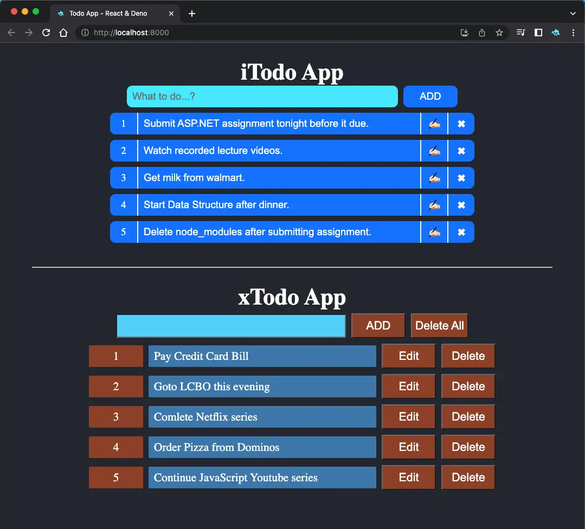

## Api Server

## Pet Inventory

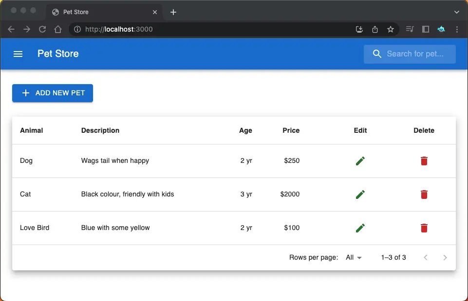
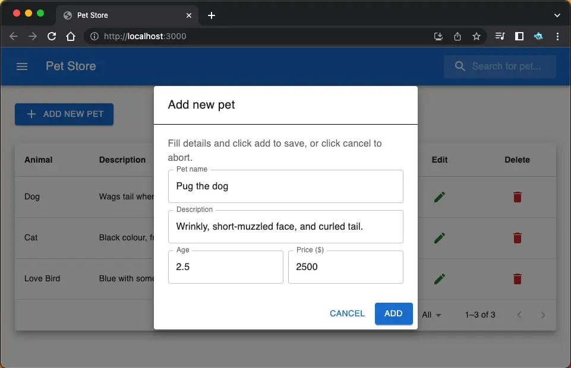
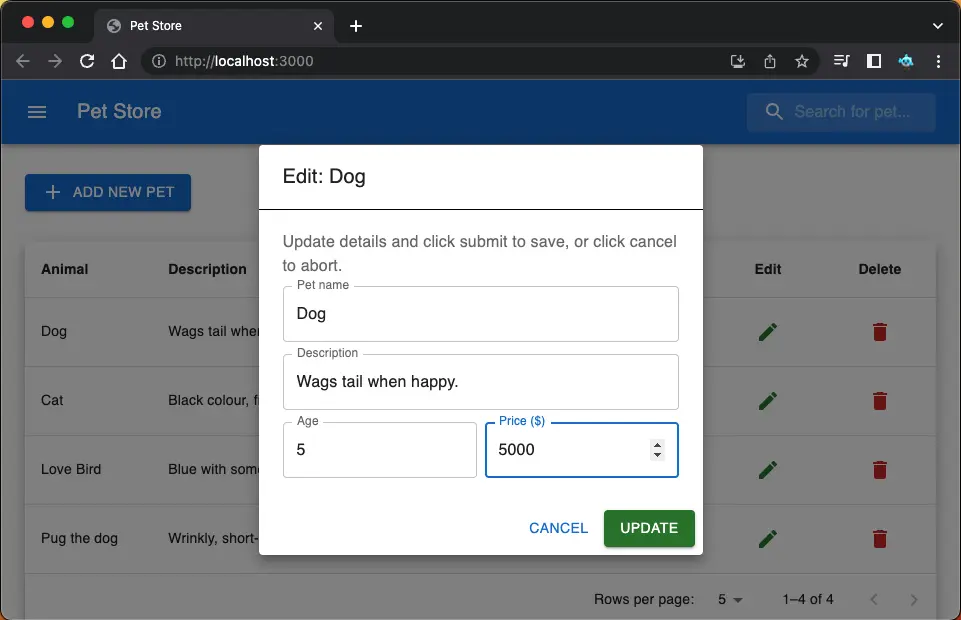
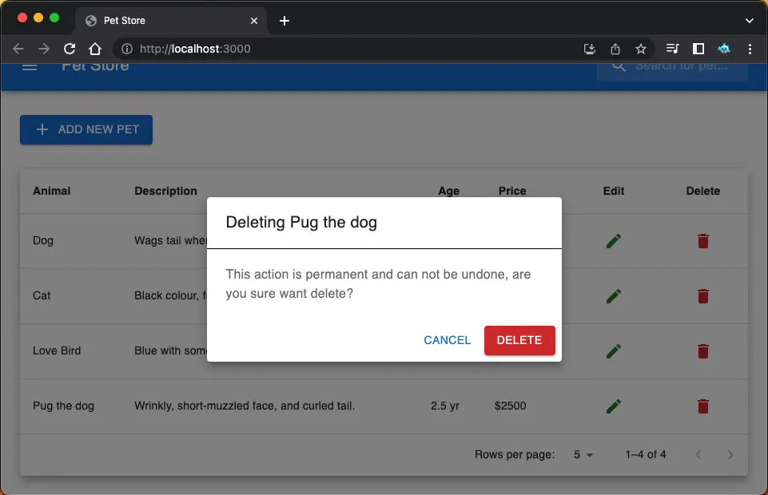
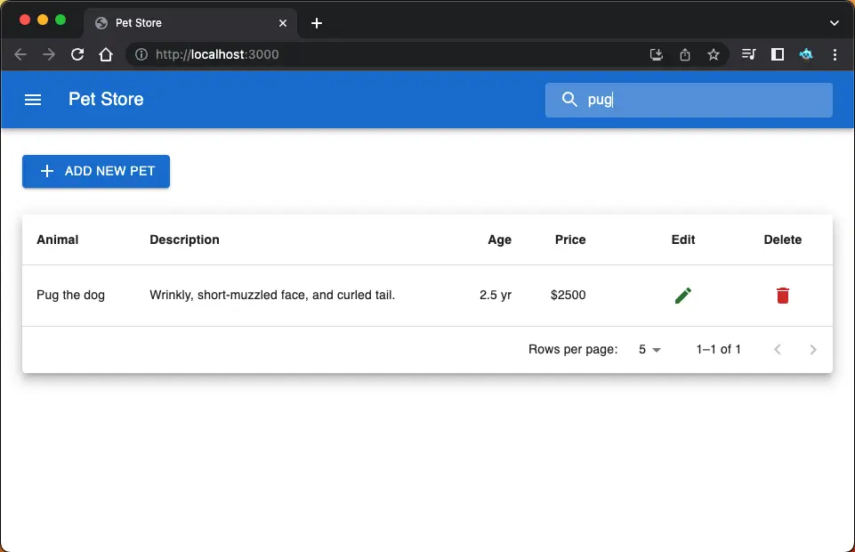

## Shopping Bazar

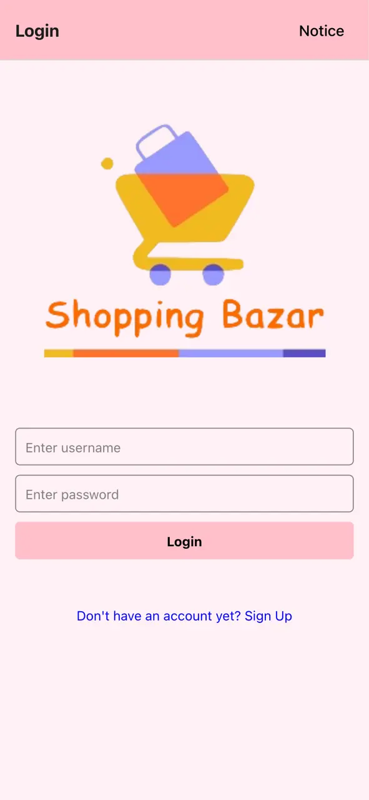
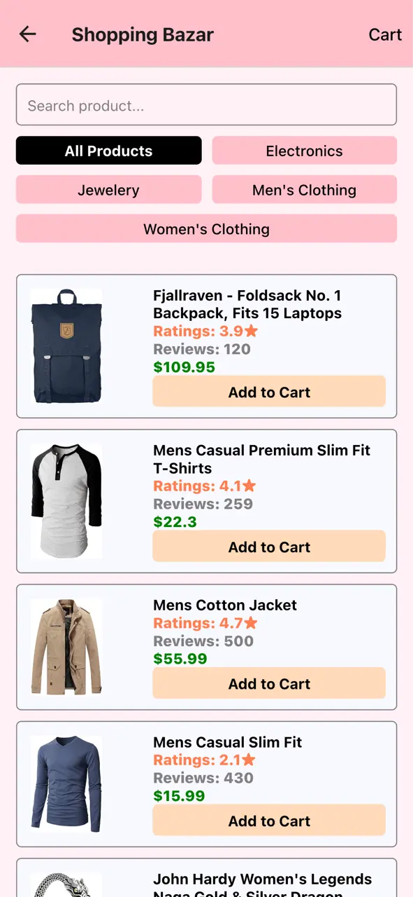
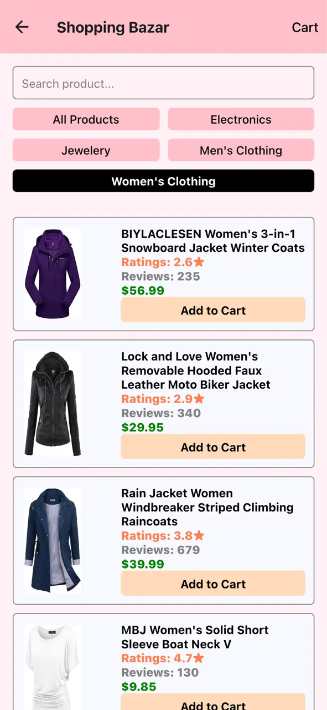
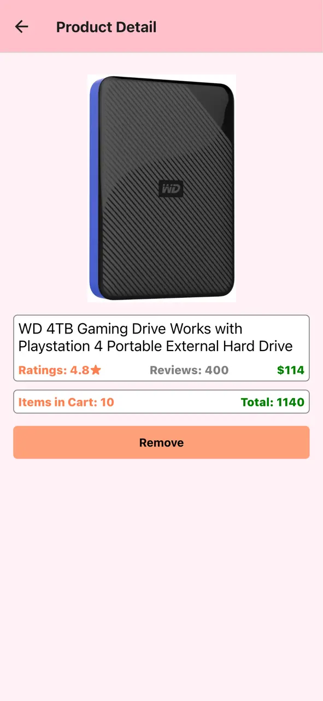
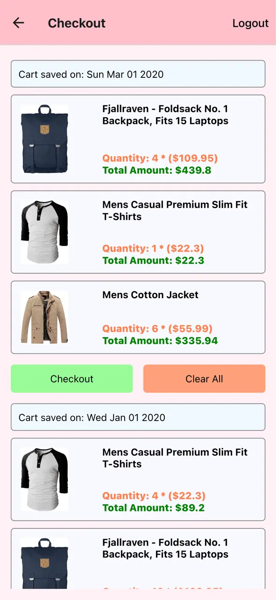

## Dice Game (inline)

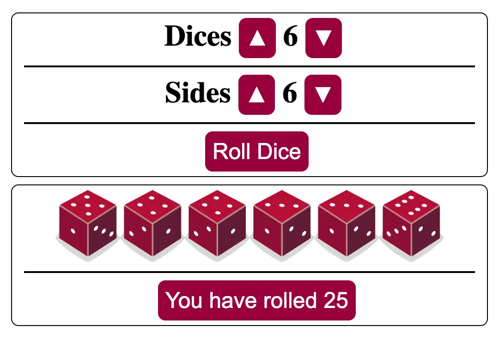
