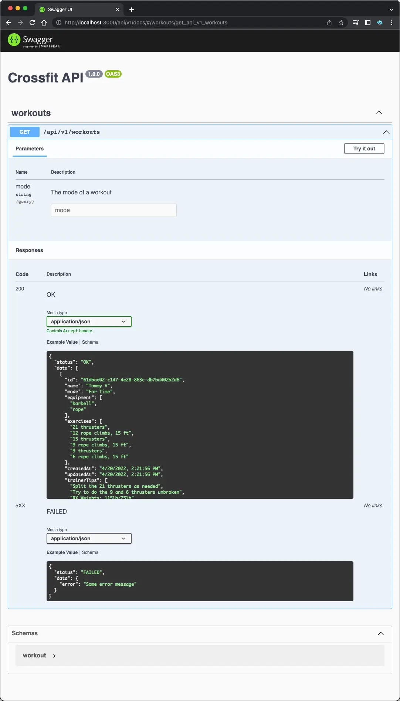

# API Server

Represents design architecture for API Server using file based data storage with
endpoint testing by Swager JS and API versioning for easy migration.

```shell
npm install
npm run dev
```

## Preview


