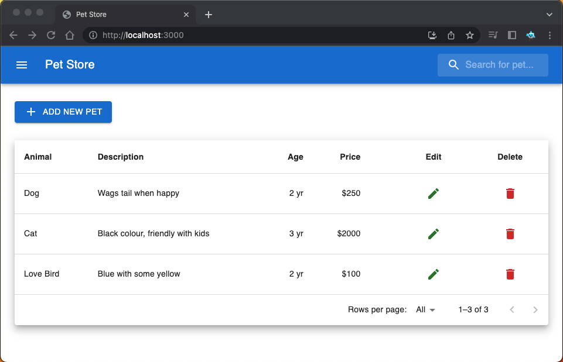
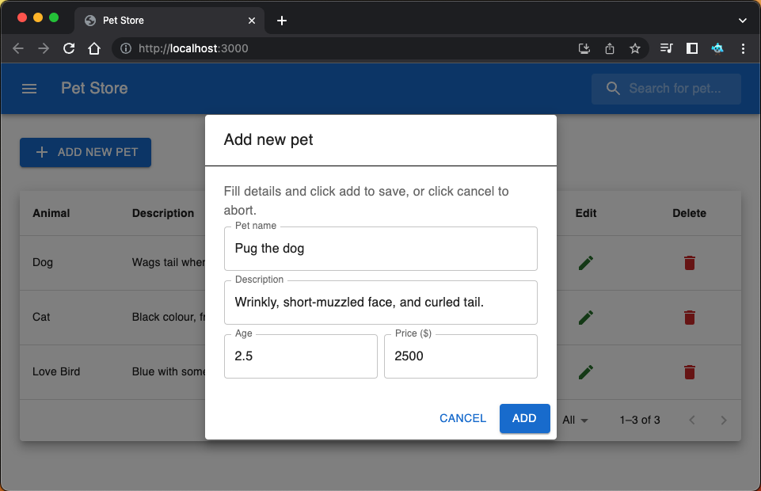
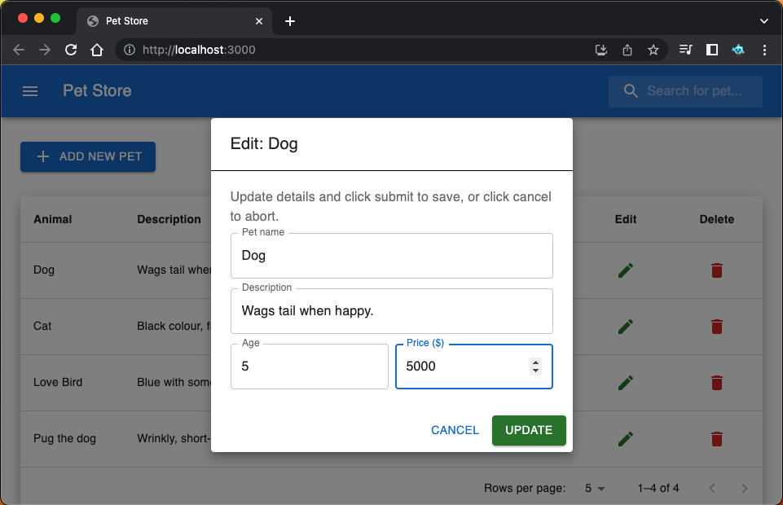
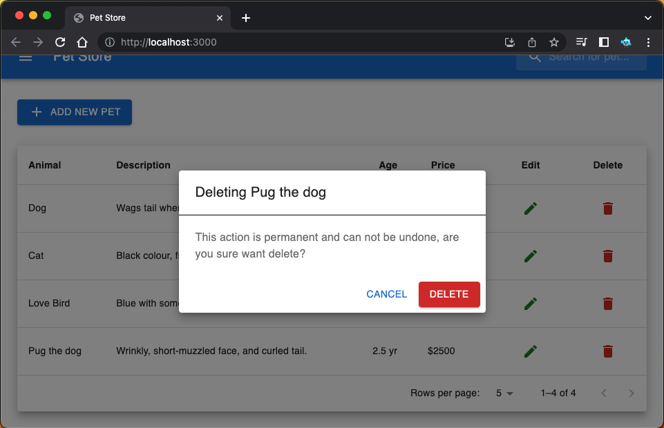
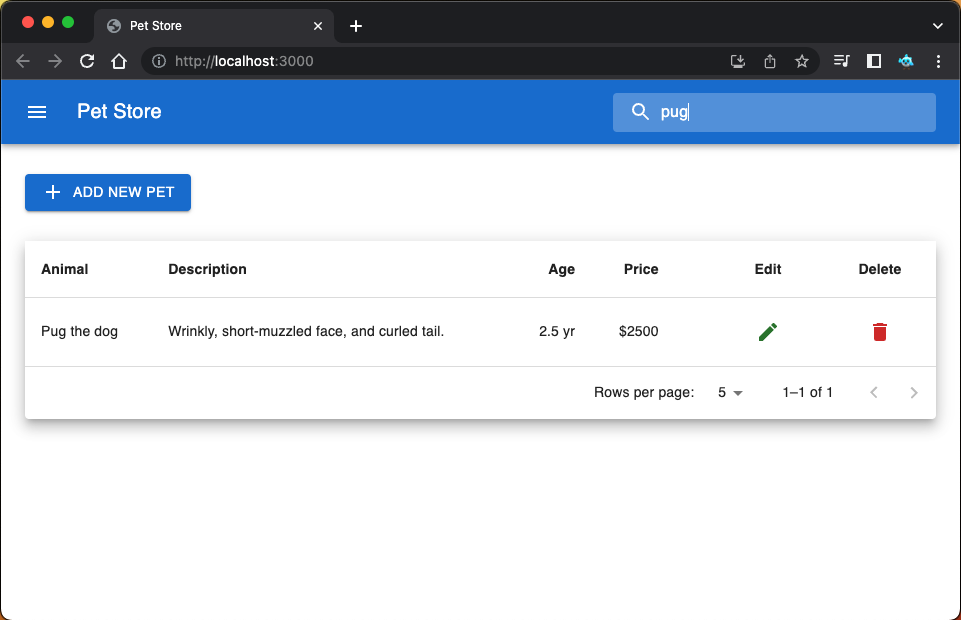

# Pet Inventory

ReactJS app for managing Pet Inventory store. This app depends on
[inventory api](./server/index.js) provider to store inventory data.

## Install and Run

Make sure to start api service before running the app, see next section.

```shell
npm install
npm run start
```

## API Service

SQLite3 based API server used for Pet Inventory React JS app.

```shell
npm install
npm run server
```

## Preview

 
 

