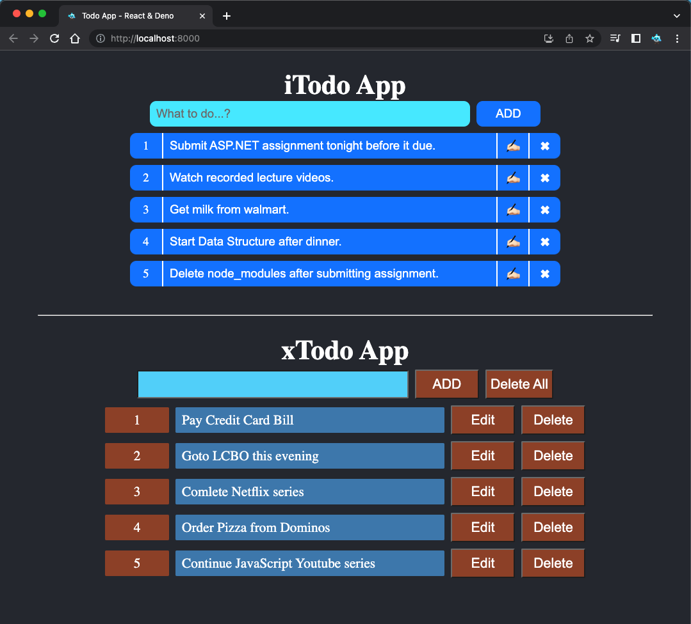

# Todo App: ReactJS: Two Todo apps (Deno.js)

- Single page Todo app using React and internal states.
- Yet another Todo app, that demonstrates simple design.

## Install deno-create-react-app

```shell
deno install -A --unstable -n deno-create-react-app https://deno.land/x/create_react_app/mod.ts
```

## Create new React app

```shell
deno-create-react-app init todo-app
```

## Run

```shell
deno-create-react-app run
```

## Preview


