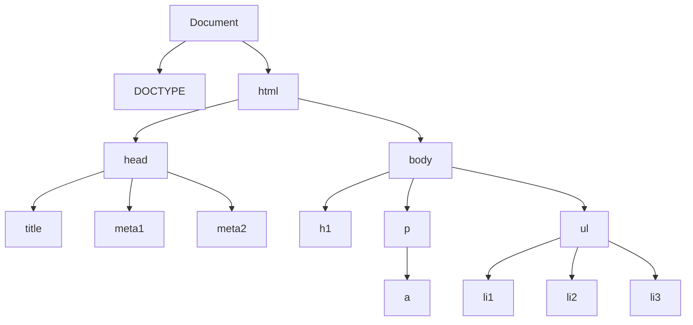

## ReactJS

- Front-end JavaScript library for creating interactive user interfaces
- Developed by **Jordan Walke** software engineer at Facebook in 2011 for
  newsfeed
- Open sourced in May 2013 at **JSConf**
- React Native for iOS and Android development released in 2015
- ReactJS makes creating **SPAS** easier
- Other popular frameworks following SPA model:
  - AngularJS 1.x vs. Angular 2.x
  - Not compatible with AngularJS, it's a ground-up rewrite, causing much
    confusion and frustration
  - Vue.js now rapidly rising in popularity
  - Ember.js, Meteor.js

## Why React?

- React is requested by employers about equally with Angular
- But it's widely considered easier to learn than Angular
- Concepts learned in React will help you learn the others

## ReactJS: a word of warning

- ReactJS changes the way we've done front-end development pretty fundamentally
- Tendency for some developers to reject it at first, may feel like starting all
  over again!
- On the ReactJS website they post a link to
  [Give it 5 minutes](https://signalvnoise.com/posts/3124-give-it-five-minutes)
- And keep in mind it's intended for larger web apps where the extra investment
  is worth the cost!
- Re-usability may not seem important in a 2,000 lines of code web app, but what
  about a 2,000,000 lines of code web app?

## The DOM tree



## Why ReactJS?

- DOM issues a key motivator for creation of ReactJS
- Modern websites have extremely complex DOM trees, many nodes and huge depth
- Thousands and thousands of div tags
- Modern websites involve much more DOM manipulation than was ever really
  envisioned
- Single page applications need to modify DOM tree frequently and substantially
- DOM operations are difficult for a developer to manage, especially as
  complexity increases
- jQuery event handling typically involves finding every node impacted by an
  event, and possibly updating it
- DOM manipulation is very expensive in terms of browser resources
- Each update causes "browser reflow" where the browser must re-render part of
  the page
- This very easily becomes the most resource intensive part of a web
  application!
- Key aspects of good software development:
  - Re-usability
  - Encapsulation / information hiding
  - Do we get these out of the box with HTML5?
  - Maybe re-usability with templates? Not really though
  - ReactJS allows us to create re-usable components
  - Can combine existing components in a new way to save development time!
  - Components can interact – can create a hierarchy where it makes sense (e.g.
    lists and list elements)
  - Use a "new" language JSX to define these components easily

## ReactJS uses a virtual DOM

- One key ReactJS feature is the virtual DOM
- Virtual DOM is lightweight abstraction of the DOM
- ReactJS essentially keeps a local and simplified copy of the DOM as part of
  its operation
- When ReactJS detects changes to app state
- It does a **diff** between the last virtual DOM render
- Handles any required DOM updates efficiently

## ReactJS

- ReactJS handles visual/DOM aspect of SPAs
- Other libraries required to handle other problems
- E.g. ReactRouter have the browser URL bar change in response to user actions
- Remember that users expect websites to do this and to be able to copy link,
  how does an SPA handle that?
- This _do one thing well_ approach contrasts with Angular, a framework that
  does many things

## First React App - libraries

- Including `react.js` and `react-dom.js`
- These contain the core React library and the functionality for React to work
  with the DOM

```html
<!-- Use latest available version, here react v17.0 -->
<script src="https://unpkg.com/react@17/umd/react.development.js" crossorigin></script>
<script src="https://unpkg.com/react-dom@17/umd/react-dom.development.js" crossorigin></script>
```

## First React App - babel

- Including the Babel JavaScript Compiler
- Will be used to compile the _new_ JSX language we'll use to more easily define
  components

```html
<!-- Use latest available version, here babel v6.0 -->
<script src="https://unpkg.com/babel-standalone@6/babel.min.js"></script>
```

## First React App – text/babel script

- The type attribute of the script tag is set to `text/babel` to let the Babel
  compiler know that it should compile the script tag contents

```html
<script type="text/babel"></script>
```

## First React App – JSX code

- The JSX code is the `<h1>Hello, World</h1>`
- We will use JSX code to define our UI with React apps
- JSX code is actually compiled by Babel into JavaScript code
- And it's as odd as it sounds at first we have a language that looks like HTML
  (but isn't) inside a script tag, that's inside an actual HTML document, and it
  gets compiled to JavaScript before our page displays

```js
ReactDOM.render(<h1>Hello, World</h1>, document.body);
```

## First React App – ReactDOM.render

- `ReactDOM.render` connects the world of React components to the world of
  HTML/CSS
- First argument is what to render, second argument is where to render it

```js
ReactDOM.render(<h1>Hello, World</h1>, document.body);
```

## First React App – React.createElement

- We could've also used `React.createElement` to create the element, instead of
  JSX
- This is the type of code that Babel compiles JSX code to
- Notice we have a destination other than body
- Typical to render into a container div or element

```js
ReactDOM.render(
  React.createElement("h1", null, "Hello, World!"),
  destination,
);
```

## React Developer Tools

- In order to get helpful error messages in the browser, we'll want to install
  the React Developer Tools plugin
- [Firefox](https://addons.mozilla.org/en-CA/firefox/addon/react-devtools)
- [Chrome](https://chrome.google.com/webstore/detail/react-developer-tools/fmkadmapgofadopljbjfkapdkoienihi)
