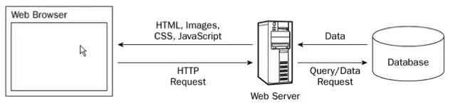
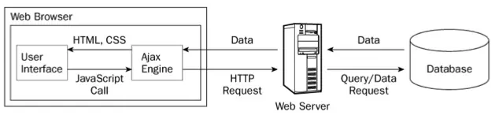

# Ajax

- Asynchronous JavaScript and XML
- In modern applications, the XML part is not used and is replaced with JSON

## Traditional Web Coding

- In traditional Web coding, information from a database or file is obtained in
  the following manner:
  - create an HTML form
  - GET or POST data to the server
  - the browser loads a complete results page (HTML, Images, CSS, JS, etc)
- Since the server returns a new page each time the user submits input,
  - Turn around for each new page refresh may make application run slowly
  - GUI is not as user-friendly as a desktop application



## AJAX

- AJAX does not require the page to be reloaded
  - JavaScript communicates directly with the server using the XMLHttpRequest
    object
  - The browser stays on the same page (no refresh)
  - Server only returns data (string, XML, JSON)
  - User doesn't notice that JavaScript is communicating with the server in the
    background.
  - The browser is not locked up during these operations because the operation
    is Asynchronous



## XMLHttpRequest Object

- XMLHttpRequest is a JavaScript object that was designed by Microsoft, adopted
  by Mozilla, and is now being standardized by W3C
- Very tedious to use we won't use it (jQuery much better way to do it)

```js
function loadXMLDoc(url) {
  // branch for native XMLHttpRequest object
  if (window.XMLHttpRequest) {
    req = new XMLHttpRequest();
    req.onreadystatechange = processReqChange;
    req.open("GET", url, true);
    req.send(null);
    // branch for IE/Windows ActiveX version
  } else if (window.ActiveXObject) {
    isIE = true;
    req = new ActiveXObject("Microsoft.XMLHTTP");
    if (req) {
      req.onreadystatechange = processReqChange;
      req.open("GET", url, true);
      req.send();
    }
  }
}
// ...and lots more code
```

- Note that there is one object for IE and one for all the other browsers

## Simple Loader

- A simple use of jQuery AJAX is to load HTML from an external file into an area
  of the DOM
- `.load()` sets the HTML contents of the matched element to the returned data
- In this example, a GET is sent to the server

```js
$("#content").load("stats.html");
```

- The `.load()` method allows a part of a remote document to be fetched
- A selector is used to identify which portion of the remote document to
  retrieve
- Remote document text has elements with id attributes

```js
$("#content").load("simple.txt #poem");
```

- The `.load()` method will call an external PHP script
- If an object map is included, it will POST these key-value pairs
- Provides for a call back function upon completion of the action

```js
$("#content").load(
  "simple.php",
  { "choice": "lorem" },
  function () {
    $("#msg").html("Loading Lorem Ipsum...");
  },
);
```

## Sending Post or Get Data

```js
$.get(
  "postget.php",
  { "act": "edit" },
  function (data) {
    alert(data);
  },
);

$.post(
  "postget.php",
  { "act": "insert" },
  function (data) {
    alert(data);
  },
);
```

## serialize() method

- Creates a text string in standard URL-encoded notation from a set of form
  elements
- Needed when posting form values via AJAX

```js
$("#form1").serialize();
```

- Returns a text string

```
lname=Charlie+&fname=+Brown+&phone=121-3456+&email=Charlie%40brown.com
```

## serializeArray() method

- Creates a JavaScript array of objects from a set of form elements
- Useful for iterating over form values

```js
$("#form1:text").serializeArray();
```

- Returns an object

```json
[
  {
    "name": "lname",
    "value": "mouse"
  },
  {
    "name": "fname",
    "value": "mickey"
  },
  {
    "name": "phone",
    "value": "555-1212"
  }
]
```

## Returning Data to an AJAX Call

- Data is returned from an AJAX call via the PHP `echo` statement
- All types of data are essentially strings...
- Types of data that can be returned
  - XML
  - JSON array
  - String data containing HTML

## Returning XML Data

- The original spec called for an XML document to be returned (the X in Ajax)
- This is not very popular
- XML document has to be parsed by JavaScript to retrieve returned data for
  subsequent use. This is tedious
- Need to parse this document in Javascript

```xml
<note>
    <to>Tove</to>
    <from>Jani</from>
    <heading>Reminder</heading>
    <body>Don't forget me this weekend!</body>
</note>
```

## Returning String Data

- Text strings of HTML data can be returned from an AJAX call
- For example, a PHP script will build an HTML result table from an SQL query
  and package it into a string
- This string will be returned to JavaScript and placed somewhere on the page
- This technique is limited
- No ability to send to Meta information (switches, status information, etc)
- Used for only simple interactions.

## JSON

- JSON – JavaScript Object Notation
- JSON is a string representation of a JavaScript Object (array Map)
- The JSON format was originally specified by _Douglas Crockford_, and is
  described in RFC 4627
- The JSON format is often used for serializing and transmitting structured data
  over a network connection.
- It is used primarily to transmit data between a server and web application,
  serving as an alternative to XML.

## JSON Arrays

- JSON arrays returned from most server APIs are highly nested.

```json
{
  "id": "0001",
  "type": "donut",
  "name": "Cake",
  "ppu": 0.55,
  "batters": {
    "batter": [
      {
        "id": "1001",
        "type": "Regular"
      },
      {
        "id": "1002",
        "type": "Chocolate"
      },
      {
        "id": "1003",
        "type": "Blueberry"
      }
    ]
  },
  "topping": [
    {
      "id": "5001",
      "type": "None"
    },
    {
      "id": "5002",
      "type": "Glazed"
    },
    {
      "id": "5005",
      "type": "Sugar"
    }
  ]
}
```

## Converting JSON strings to JS Objects

- JSON arrays are transmitted from the server to the browser as string
  representations of the JSON object.
- To convert a JSON text into an object, the `eval()` function is used.
- jQuery does this automatically for you
- Since JSON is a subset of JavaScript property maps, compiler will parse it
  correctly.
- The text must be wrapped in parentheses to avoid ambiguity.

```js
var myObject = eval("(" + myJSONtext + ")");
```

## Returning JSON data from PHP

- Associative arrays are converted to JSON data with the json_encode() function
  in PHP
- This JSON string is sent to the calling AJAX with the echo function
- This is a very good technique to use in AJAX
- Data very similar to the template array ($TPL) can be sent for processing by
  JavaScript
- The template is preserved as only data is sent (no HTML)
- Requires a more sophisticated programming effort as the returned object is
  used to build HTML tables or ordered lists in JavaScript (jQuery to the
  rescue!)
