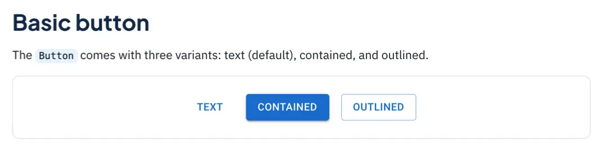
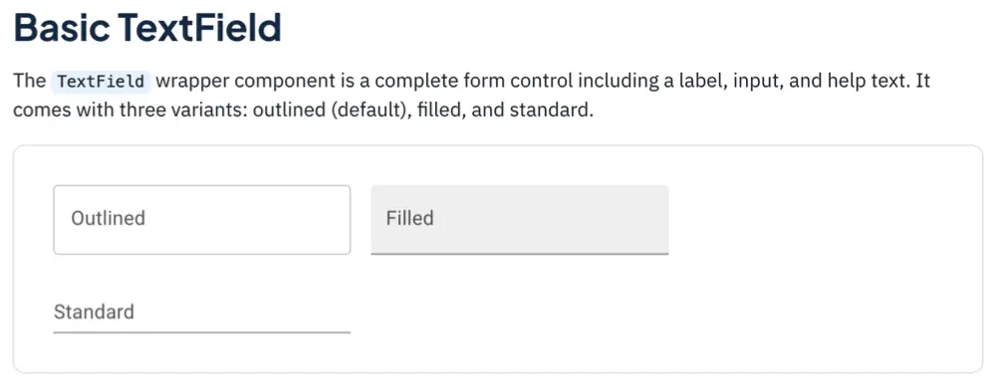
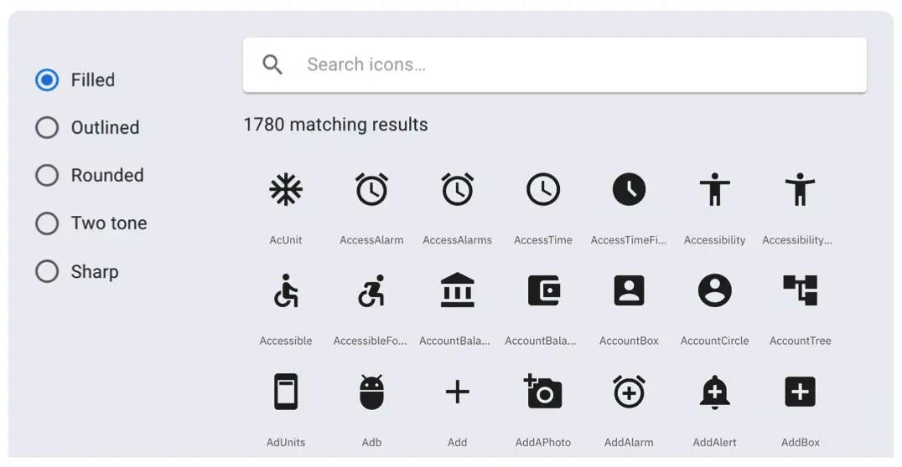

# Material UI

- [Material UI](https://mui.com) provides a library of React components
- The components provide user interface building blocks for creating an
  application
- Components come with a default professional style, style can be altered
  further with customization/themes
- A bit like Bootstrap, but for React, in this regard
- Install Material UI packages with:

```shell
npm install @mui/material @emotion/react @emotion/styled @mui/icons-material
```

## Using components requires to use them in JSX expressions



```jsx
<Button variant="text">Text</Button>
<Button variant="contained">Contained</Button>
<Button variant="outlined">Outlined</Button>
```

## Import the components

```jsx
import * as React from "react";
import Stack from "@mui/material/Stack";
import Button from "amui/material/Button";

export default function BasicButtons() {
  return (
    <Stack spacing={2} direction="row">
      <Button variant="text">Text</Button>
      <Button variant="contained">Contained</Button>
      <Button variant="outlined">Outlined</Button>
    </Stack>
  );
}
```

## Documentation similar to Bootstrap



```jsx
<TextField id="outlined-basic" label="Outlined" variant="outlined" />
<TextField id="filled-basic" label="Filled" variant="filled" />
<TextField id="standard-basic" label="Standard" variant="standard" />
```

## Extensive list of icons is available


