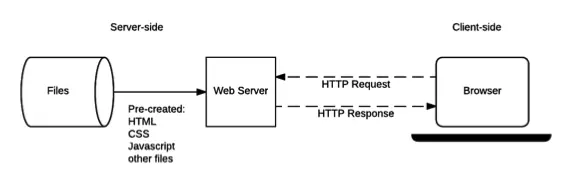

# React Native

- React Native allows us to create "native" applications using React
- A React Native application is defined using React components
- But when the application is running on the device:
  - Instead of running in a browser, React Native runs in a special process that
    communicates with the device API
  - Real device-specific native user interface elements (buttons, etc) are
    rendered in a native application

## React Native Architecture


## Why React Native?

- Facebook's initial HTML5-based mobile web app had a poor user experience
- Especially relative to purpose-built native applications
- Big problem with web applications is that interface does not match the native
  interface
- Users of devices are accustomed to the native interface
- This is especially true for using installed apps, users may give more leeway
  to websites they visit in-browser
- Non-native interface on apps gives a "cheaper" feeling
- Facebook developed React Native internally in response to this issue
- Released publicly in 2015
- A key reason why React is chosen for projects
- Alternative: Flutter is another popular solution
- Architecturally similar concept, but implemented with an object-oriented
  language called Dart

## Using React Native

- To [setup an environment](https://reactnative.dev/docs/environment-setup) to
  work with React Native
- Expo is a toolchain that allows us to develop and deploy React applications
- Though a smartphone is not required, with expo you'll be able to easily run
  React Native apps on a smartphone
- You can also just run them locally in the browser

## Getting started with React Native

- Install expo-cli:

```shell
npm install -g expo-cli
```

- On a mac may need to run

```shell
sudo npm install –g expo-cli
```

- Then to create and run a React Native project:

```shell
expo init AwesomeProject
cd AwesomeProject
npm start
```

- Install the [Expo client](https://expo.dev) app on your smartphone
- It may be easier to search for "Expo" on your app store

## When asked to choose a template, pick the first blank option


## npm start will launch a dashboard


## You can run the app in a web browser using the left-side menu


## Or you can run the app in a simulator

- You need to have the platform specific development tools installed in order
  for this to work
  - Xcode (macOS) - iOS Simulator or Physical Device
  - Android Studio - Android Emulator or Physical Device
- If you have the Expo app installed on your device, you can scan the QR code
  using your device's mobile camera

## Expo

- Expo makes the process of creating React Native applications much less arduous
- We can get going in minutes and the process to test applications is relatively
  straightforward
- It wasn't always like this, just getting an application to run on a device at
  all was a much more painful and less automated process
- The takeaway: toolchains like `create-react-app` and `expo` are important
- If we open up `App.js` we can change the `text/code` and you should see the
  effect immediately in the browser, simulator and even in the Expo app on your
  device

```jsx
import { StatusBar } from "expo-status-bar";
import React from "react";
import { StyleSheet, Text, View } from "react-native";

export default function App() {
  return (
    <View style={styles.container}>
      <Text>Open up App.js to start working on your app</Text>
      <StatusBar style="auto" />
    </View>
  );
}

const styles = StyleSheet.create({
  container: {
    flex: 1,
    alignItems: "center",
    justifyContent: "center",
    backgroundColor: "#fff",
  },
});
```

## Developing React Native apps

- Developing React Native apps will involve using a set of pre-defined
  components
- For example a "React Native" component to display an image, a button, a view,
  etc
- And each one of these components gets translated to its iOS, Android or web
  equivalent when the app is running
- When we make a View, Text or Image component in React Native it gets
  translated to its native equivalent on either platform

## Core components and their equivalents on Android, iOS, Web


## Venn diagram of relationship between React Native Components and React Components.

- Notably we can make our own React Native components


## Handling text input

- We need a state variable and set function

```js
const [text, setText] = useState("");
```

- And then we use an `onChangeText` prop with an event handler

```jsx
<TextInput value={text} onChangeText={(text) => setText(text)} />;
```

## Styles

- All core React Native components accept a prop called style that accepts an
  object

```jsx
<Text style={{ fontSize: 96 }}>Scroll me please!</Text>;
```

- Object keys correspond to CSS style properties, with values corresponding to
  CSS values
- Except we need to use `camelCase` instead of `-`
- So `background-color` becomes `backgroundColor`

## StyleSheet object

- We can create [StyleSheet](https://reactnative.dev/docs/stylesheet) objects
  explicitly for the purpose of styling

```js
const styles = StyleSheet.create({
  container: {
    marginTop: 50,
    // other attributes...
  },
  // other style groups...
});
```

- Advantage: styles are validated, unlike when using raw JavaScript objects to
  style

## ScrollView

- [ScrollView](https://reactnative.dev/docs/using-a-scrollview) allows us to
  present a scrollable container of components and views
- i.e. user can swipe up and down to view content
- Options
  - Can allow horizontal scrolling by setting `horizontal` prop
  - Can allow paging by using the `pagingEnabled` prop
  - On iOS we can have pinch to zoom in and out by setting props
    `maximumZoomScale` and `minimumZoom` scale

## ListView

- React Native provides a group of components for rendering lists, two in
  particular are widely used
- FlatList
  - Renders a flat list of elements
- SectionList
  - Renders a list of elements underneath section headings

## FlatList

- FlatList uses two props:
  - `data` for the array of data to present in the list
  - `key` property of the object is used by React Native by default to set the
    unique key of each list item expected by React
  - `renderItem` to supply a function to render each item

```jsx
<FlatList
  data={[{ key: "A" }, { key: "B" }, { key: "C" }]}
  renderItem={({ item }) => <Text style={styles.item}>{item.key}</Text>}
/>;
```

## keyExtractor

- An optional `keyExtractor` prop can be used to set a function that extracts a
  unique key from each item

```jsx
const data = [{ text: "A", id: "1" }, { text: "B", id: "2" }];

<FlatList
  data={data}
  renderItem={renderItem}
  keyExtractor={(item) => item.id}
/>;
```

## SectionList

- Provide a sections prop with array of sections, each with a title and array of
  data
- Also need to supply `renderSectionHeader` prop

```jsx
const sections = [
  {
    title: "D",
    data: ["Dev", "Dan", "Dom"],
  },
  {
    title: "J",
    data: ["Jack", "James", "Jill"],
  },
];

<SectionList
  sections={sections}
  keyExtractor={(item, index) => index}
  renderItem={({ item }) => <Text>{item}</Text>}
  renderSectionHeader={({ section }) => <Text>{section.title}</Text>}
/>;
```

## Buttons

- Buttons can be created with the `<Button />` component
- `onPress` event is used for handling button press

```jsx
<Button
  onPress={() => {
    alert("You tapped the button!");
  }}
  title="Press Me"
/>;
```

## Touchable

- Touchable is an alternative to buttons
- Allow for feedback while button is being pressed and different options such as
  long button presses
- Touchable:
  - `TouchableHighlight` darkens background when pressed
  - `TouchableOpacity` makes background visible on press
  - `onLongPress` event for detecting a long button press

## Flexbox

- React Native supports the same flexbox algorithm used by CSS flexbox
- The expectation is we'll use flexbox to create layouts
- There are a few differences from CSS:
  - `flexDirection` defaults to column instead of row
  - `alignContent` defaults to flex-start instead of stretch
  - `flexShrink` defaults to 0 instead of 1
  - `flex` only accepts a single number

```jsx
const Flex = () => {
  return (
    <View style={[styles.container, { flexDirection: "column" }]}>
      <View style={{ flex: 1, backgroundColor: "red" }} />
      <View style={{ flex: 2, backgroundColor: "darkorange" }} />
      <View style={{ flex: 3, backgroundColor: "green" }} />
    </View>
  );
};

const styles = StyleSheet.create({
  container: {
    flex: 1,
  },
});
```

- We get a 1/6, 2/6, 3/6 row ratio

<!-- Visualize above ratios with sized boxes -->
<div style="display: flex; flex-direction: column; height: 600px;">
    <div style="flex: 1; background-color: plum;"></div>
    <div style="flex: 2; background-color: burlywood;"></div>
    <div style="flex: 3; background-color: cornflowerblue;"></div>
</div>
<br />

## Flexbox ratio

- We add up the numbers assigned to flex to get the denominator
- Each component is then given X / denominator portion of space
- Where X is the number for that component's flex value
- We could set `flexDirection` to `row` to align the components horizontally

## With flexDirection set to row

```js
const styles = StyleSheet.create({
  container: {
    flex: 1,
    flexDirection: "row",
  },
});
```

<!-- Visualize above ratios with sized boxes -->
<div style="display: flex; flex-direction: row; height: 100px;">
    <div style="flex: 1; background-color: plum;"></div>
    <div style="flex: 2; background-color: burlywood;"></div>
    <div style="flex: 3; background-color: cornflowerblue;"></div>
</div>
<br />

## flexDirection, children prop

- More flexDirection options:
  - row-reverse aligns components from right to left
  - column-reverse aligns components from bottom to top
  - Components can accept a prop called children that contains any JSX enclosed
    in the components
- So we could then render `{children}` in our return of JSX (or render function
  in the case of class components)

## Layout direction

- Layout direction specifies the direction in which children in a hierarchy
  should be laid out
- LTR will lay children out from left to right
- RTL will lay children out from right to left

## justifyContent

- `justifyContent` sets how to layout children along the main axis of their
  container/parent
- `flex-start` aligns children to start of the component
- `flex-end` aligns children to end of the component
- `center` aligns children to center of the component
- `space-between`, `space-around`, `space-evenly` are all variations on how to
  space out components relative to one another and the component boundaries

## alignItems

- `alignContent` works like `justifyContent` except it is applied to the
  cross-axis of the container
- So if the container has a row flex direction then `alignContent` will be
  applied to column axis
- stretch will stretch children to match height of the container's cross-axis
- So long as the child does not have a fixed width

## alignSelf

- `alignSelf` works like `alignItems` except it only applies to a single
  component
- `alignSelf` will override any options set by the parent with `alignItems`

## flexWrap

- `flexWrap` determines what happens when components overflow their container
- `wrap` will cause components to wrap and form a new "line" in the container
  (by default components form a "single line")
- `nowrap` will overflow the components beyond the container
- `alignContent` can be used to align the lines of components formed by wrapping
  components
- Uses similar `flex-start`, `flex-end`, `space-between`, etc values to specify
  how this is done

## Width and Height

- Width and Height can be used to specify the width and height of a component's
  content area
- Can be set using `auto`, `pixels` or `percentage`
- Percentage is a good idea to accommodate for different mobile device screen
  sizes

## HTTP protocol

- HTTP protocol is used for standard website traffic
- Server-client communication: HTTP requests are sent by the browser, server
  returns an HTTP response in return
- HTTP typically thought of as sending back website files like HTML, CSS,
  JavaScript, images, etc



## Web Services

- Web services, broadly defined, are a set of functionalities provided to
  clients over the **www**
- e.g. databases, stock market data, payment processing, social media feeds,
  restaurant reviews any set of data and services
- HTTP can be used to serve XML, JSON data for other computers to use as much as
  it can HTML/CSS for humans using web browsers
- Web services are APIs available to other web applications via http requests
- We could also use the term web APIs
- Web services are offered by virtually all major apps
- e.g. you can access all public Twitter data via an API, and post Tweets to
  accounts you have access to
- It's advantageous for companies to open their data like this, it allows
  developers to build on top of their app
- Often companies that make a web service available require users to register,
  obtain a key, and charge per usage over a certain usage rate
- There are many
  [web services available to the general public](https://github.com/public-apis/public-apis)
- Some public web services require us to sign-up for accounts and use a unique
  ID
- Like Google Maps, this is in-place to monitor and possibly charge for usage or
  throttle usage
- But many public APIs are completely free and without any restrictions or even
  a need to sign-up

## Coinlore API

- [Coinlore](https://www.coinlore.com/cryptocurrency-data-api) is a freely
  available
  [API for tracking cryptocurrency prices](https://api.coinlore.net/api/tickers)
- Some web service routes require no arguments, such as this one to return the
  first 100 ticker IDs

## Endpoints with parameters

- We use the term endpoints to describe an APIs different routes and associated
  functionalities
- Some endpoints accept parameters:
- `https://api.coinlore.net/api/ticker/?id=90`
- The `id` in this route is a parameter that we can set to different values
  (e.g. "90" for Bitcoin, "80" for ETH)
- This makes web services a lot like calling functions
- We make requests with different parameter values and the web service will
  return different results
- The term "calling" a route is informally used as well

## JSON Data

- Web services typically return JSON data, sometimes XML
- [JSON](https://en.wikipedia.org/wiki/JSON) stands for JavaScript Object
  Notation
- It's the most common web service output format
- Defined with objects of key:value pairs, arrays of values, where values can be
  objects, arrays or primitive types

```json
{
  "key1": "value1",
  "key2": {
    "sub-key1": "sub-val1",
    "sub-key2": "sub-val2"
  },
  "key3": [
    "val1",
    "val2",
    "val3"
  ]
}
```

## Web Services with React Native

- Use `fetch()` in our React Native apps to access web services
- What about `CORS` issue?
- Remember how in a web browser it's not possible to use `fetch()` to make
  requests from domains other than the domain from which the website was sent?
- i.e. AJAX requests can only be made to the "server of origin" and not to other
  domains/servers
- `CORS` is a security restriction for browsers, it does NOT apply to mobile
  apps, so we can use `fetch()` to make requests

## CORS issue

- The only problem is that unless you're using a simulator/emulator or device to
  test your React Native app, it's still technically running in the web browser
- So the browser itself might still block the request to a web service with a
  `CORS` error
- It actually depends on the server too, some Web Services will have an
  `Access-Control-Allow-Origin` setting enabled to explicitly allow access from
  anywhere
- Browsers make a "pre-flight check" to the server before the formal request
  occurs to determine whether the request is allowed to occur

## Error while using Web Services in React Native app (in browser only)?


## Workaround for CORS issue

- You can shut this browser behaviour off with a
  [Chrome plugin to Allow CORS](https://chrome.google.com/webstore/detail/allow-cors-access-control/lhobafahddgcelffkeicbaginigeejlf/related)
  Access-Control-Allow-Origin
- You should only enable it when testing your React Native app
- Another very similar extension called
  [Moesif Origin & CORS Changer](https://chrome.google.com/webstore/detail/moesif-origin-cors-change/digfbfaphojjndkpccljibejjbppifbc?hl=en-US)

## React Native with Web Services

- [Official website](https://reactnative.dev)
- [Getting Started](https://reactnative.dev/docs/getting-started)
- [Network documentation](https://reactnative.dev/docs/network)
- [Publicly available APIs](https://github.com/public-apis/public-apis)

## CORS plugins:

- [allow-cors-access-control](https://chrome.google.com/webstore/detail/allow-cors-access-control/lhobafahddgcelffkeicbaginigeejlf/related)
- [moesif-origin-cors-change](https://chrome.google.com/webstore/detail/moesif-origin-cors-change/digfbfaphojjndkpccljibejjbppifbc?hl=en-US)
